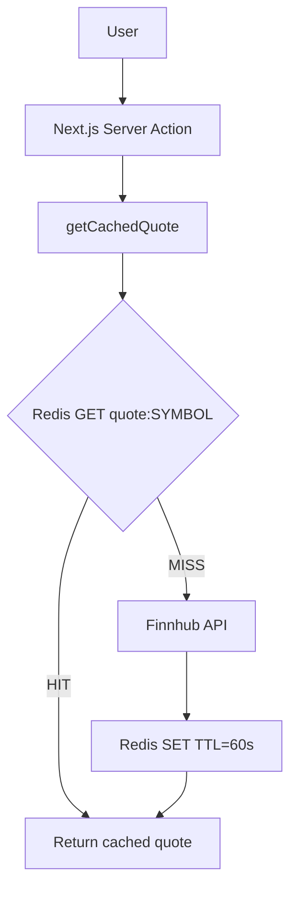
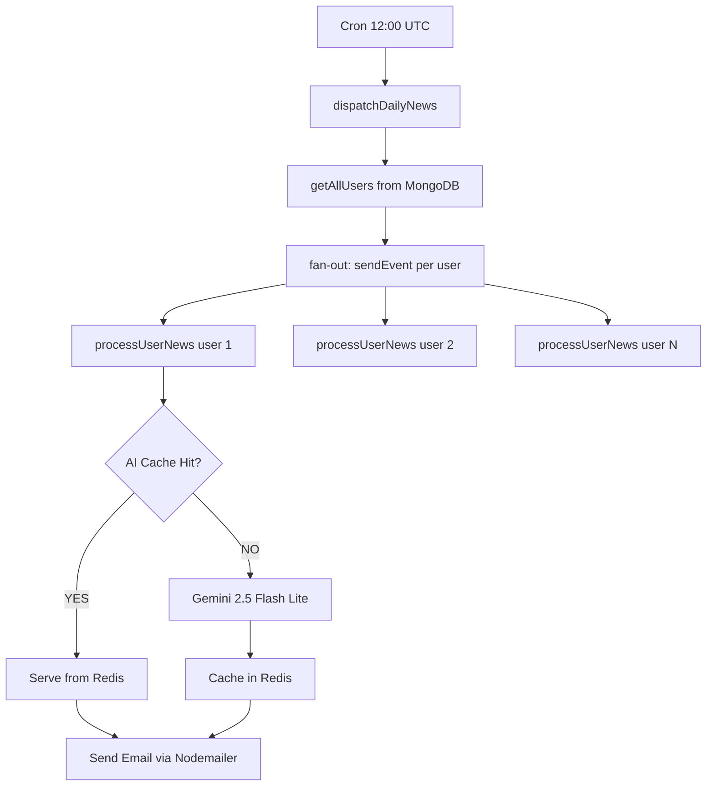
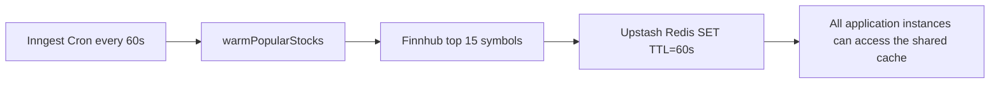
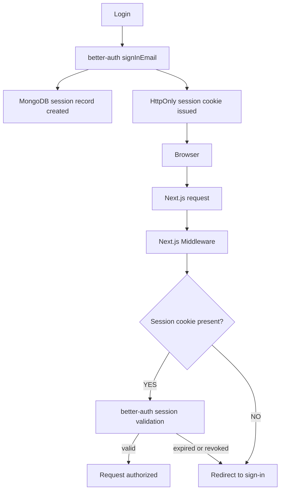

# QuantPulse — Market Intelligence Platform

> A full-stack market intelligence platform designed to handle external API limits, distributed caching, background processing, and personalized notifications.


---

## What It Does

QuantPulse lets users track stock watchlists, receive AI-summarized daily market news, and configure price alerts — delivered through a layered architecture designed around real engineering constraints.

- **Watchlist** — search and track stocks with market quote data served from a distributed Redis cache
- **Market News** — AI-personalized daily digest via Gemini 2.5 Flash Lite, with Redis response caching
- **Price Alerts** — upper/lower boundary alerts with email notifications, checked every 5 minutes via Inngest cron
- **Authentication** — persistent SaaS-style sessions via better-auth (7-day TTL, rolling refresh)

---

## Engineering Problems & Solutions

### Problem 1 — Direct API Call on Every Request

Each watchlist page render made a direct Finnhub API call per symbol, per request. Under concurrent load this approaches rate limits immediately, and every serverless cold start pays the full network round-trip to Finnhub.

**Solution:** Two-layer cache-aside strategy:

1. **Upstash Redis** (`getCachedQuote`) — shared distributed cache accessible across all application instances. A Redis GET on a cached symbol avoids the Finnhub call entirely.
2. **Next.js fetch caching** — secondary caching/revalidation layer with a 60s TTL where configured (`next: { revalidate: 60 }`).

The Redis layer is the critical one: the application-level fetch cache does not provide the same shared cross-instance cache semantics as Upstash Redis. Redis provides a shared cache that can be accessed across application instances regardless of how many are running.

### Problem 2 — Cold Start Cache Misses

Without a shared cache layer, a newly-started instance has no warm cache state for popular symbols.

**Solution:** Inngest cron (`warmPopularStocks`) runs every 60 seconds and pre-loads quotes for the top 15 popular symbols into Upstash Redis with a 60-second TTL. Because Redis is shared infrastructure, even a brand-new cold-start instance gets a cache hit for popular symbols.

```
Before: Cold start -> Finnhub API request -> response
After:  Cold start -> Redis cache lookup  -> cached response
```

### Problem 3 — Sequential Email Dispatch

The daily news email was sent to all users inside a single function, sequentially. This means one user's failure blocks all subsequent users, there are no retries, and processing time grows linearly with user count.

**Solution:** Inngest fan-out architecture. A lightweight dispatcher (`dispatchDailyNews`) fetches all users and emits one `app/user.process_news` event per user. Each event is handled by an independent `processUserNews` worker with:
- Concurrency limit of 5 simultaneous workers
- 3 automatic retries per worker
- Isolated failure scope — one user failing does not affect others

```
Before: Single function loops over N users — O(n) blocking, no retries

After:  dispatchDailyNews
            |
            +-- app/user.process_news (user 1) [concurrency: 5, retries: 3]
            +-- app/user.process_news (user 2)
            +-- app/user.process_news (user N)
```

### Problem 4 — Redundant AI Calls for Identical Watchlists

Users with the same watchlist symbols would each independently trigger a Gemini API call to summarize the same set of news articles — wasting tokens, adding latency, and scaling poorly.

**Solution:** Redis-backed AI response cache (`getCachedAISummary`). The cache key is derived from the user's sorted watchlist symbols. If another user with the same symbols has already received a summary that day, the Gemini call is skipped entirely and the cached summary is served from Redis.

This addresses: token consumption, duplicate work, cache key determinism, and shared distributed state.

---

## Architecture

### Quote Fetch Flow


```mermaid
graph TD
    A[User] --> B[Next.js Server Action]
    B --> C[getCachedQuote]
    C --> D{Redis GET quote:SYMBOL}
    D -- HIT --> E[Return cached quote]
    D -- MISS --> F[Finnhub API]
    F --> G[Redis SET TTL=60s]
    G --> E
```

### Daily News Fan-Out


```mermaid
graph TD
    A[Cron 12:00 UTC] --> B[dispatchDailyNews]
    B --> C[getAllUsers from MongoDB]
    C --> D[fan-out: sendEvent per user]
    D --> E1[processUserNews user 1]
    D --> E2[processUserNews user 2]
    D --> E3[processUserNews user N]
    E1 --> F1{AI Cache Hit?}
    F1 -- YES --> G1[Serve from Redis]
    F1 -- NO --> H1[Gemini 2.5 Flash Lite]
    H1 --> I1[Cache in Redis]
    G1 --> J1[Send Email via Nodemailer]
    I1 --> J1
```

### Cache Warming


```mermaid
graph LR
    A[Inngest Cron every 60s] --> B[warmPopularStocks]
    B --> C[Finnhub top 15 symbols]
    C --> D[Upstash Redis SET TTL=60s]
    D --> E[All application instances can access the shared cache]
```

### Auth Session Flow


```mermaid
graph TD
    A[Login] --> B[better-auth signInEmail]
    B --> C[MongoDB session record created]
    B --> D[HttpOnly session cookie issued]
    D --> E[Browser]
    E --> F[Next.js request]
    F --> G[Next.js Middleware]
    G --> H{Session cookie present?}
    H -- YES --> I[better-auth session validation]
    I -- valid --> J[Request authorized]
    I -- expired or revoked --> K[Redirect to sign-in]
    H -- NO --> K
```

Session configuration: `expiresIn: 7 days`, `updateAge: 24 hours` (rolling refresh on activity).

---

## Key Architecture Decisions

### Why Redis?

Used as shared distributed state for three independent concerns: quote caching, AI response caching, and API rate limiting. Unlike an in-process memory cache, Upstash Redis is accessible across all application instances simultaneously — making it effective for serverless deployments where instance count is unpredictable.

### Why Inngest?

Long-running and scheduled workloads (personalized news processing, alert checking, cache warming) cannot run inside a synchronous API request. Inngest moves them out of the request path, provides durable execution with automatic retries, and offers built-in fan-out for parallelizing per-user jobs.

### Why cache-aside pattern?

The application checks Redis first and falls back to Finnhub on a miss. On a miss, the fetched value is stored in Redis before returning. This keeps the application in control of caching logic and avoids coupling to a specific cache provider.

### Why fan-out for email dispatch?

Decomposing a bulk email job into independent per-user events means individual failures are isolated and retried without restarting the full batch. It also allows concurrency control at the worker level, preventing thundering-herd behavior against downstream APIs.

---

## Tech Stack

| Layer | Technology | Purpose |
|---|---|---|
| Framework | Next.js 16 App Router | SSR, Server Actions, API Routes |
| Language | TypeScript 5 | Type safety across full stack |
| Database | MongoDB Atlas + Mongoose | User, Watchlist, Alert storage |
| Cache | Upstash Redis | Distributed quote + AI response cache, rate limit counters |
| Background Jobs | Inngest | Fan-out email dispatch, cron cache warming, alert checks |
| Auth | better-auth | Session management, HttpOnly cookies |
| AI | Google Gemini 2.5 Flash Lite | News summarization, welcome email personalization |
| Email | Nodemailer | Transactional email delivery |
| Rate Limiting | Upstash Ratelimit | Fixed window: 100 req / 60s per IP on API routes |
| UI | Radix UI + Tailwind CSS v4 | Accessible component primitives |
| Forms | React Hook Form | Validated sign-up and alert forms |
| External API | Finnhub | Stock quotes and company news |

---

## Project Structure

```
app/
  (auth)/          # Sign-in, Sign-up pages
  (root)/          # Dashboard, Watchlist, Alerts, News
  api/auth/        # better-auth API handler
lib/
  actions/         # Next.js Server Actions / application service layer
  better-auth/     # Auth config + requireSession helper
  cache/           # Redis client, getCachedQuote, AI response cache
  inngest/         # Background job functions + cron jobs
  nodemailer/      # Email templates and sender
database/
  models/          # Mongoose schemas (Alert, Watchlist)
middlewares/       # Auth guard, rate limiter, security headers, logging
```

---

## Server Action API Docs

### auth.actions.ts

#### `signUpWithEmail(data)`
Registers a new user via better-auth, then emits an `app/user.created` Inngest event to trigger AI-personalized welcome email generation.

| Input | Type | Description |
|---|---|---|
| `email` | string | User email |
| `password` | string | Min 8 chars |
| `fullName` | string | Display name |
| `country` | string | Used for personalization prompt |
| `investmentGoals` | string | Injected into Gemini welcome email prompt |
| `riskTolerance` | string | Injected into Gemini welcome email prompt |
| `preferredIndustry` | string | Injected into Gemini welcome email prompt |

Returns: `{ success: boolean, data?: Session, error?: string }`

#### `signInWithEmail({ email, password })`
Authenticates via better-auth. Sets an HttpOnly session cookie on success. Uses a 7-day session lifetime with a 24-hour update interval for active sessions.

Returns: `{ success: boolean, data?: Session, error?: string }`

#### `signOut()`
Revokes the MongoDB session record immediately, making the cookie invalid on the next request without waiting for TTL expiry.

Returns: `{ success: boolean, error?: string }`

---

### watchlist.actions.ts

#### `getWatchlistWithDetails(email)`
Returns the user's full watchlist with market quote data. Uses `getCachedQuote()` (Redis → Finnhub cache-aside) for prices and Next.js fetch caching (`next: { revalidate: 3600 }`) for company profiles.

Returns: `WatchlistStockDetails[]` — `{ symbol, company, price, change, changePercent, marketCap }`

#### `toggleWatchlist(email, symbol, company, isAdded)`
Adds (upsert) or removes a symbol from the user's watchlist.

#### `isSymbolInWatchlist(email, symbol)`
Returns: `boolean`

---

### alert.actions.ts

#### `createAlert(email, symbol, company, alertType, targetPrice, frequency)`

| Input | Type | Values |
|---|---|---|
| `alertType` | string | `upper` or `lower` |
| `frequency` | string | `once`, `hourly`, `continuous` |
| `targetPrice` | number | Absolute price boundary in USD |

Returns: `{ success: boolean, alertId: string }`

#### `getUserAlerts(email)`
Returns all active alerts. `currentPrice` is populated client-side after fetch.

#### `deleteAlert(alertId)`
Soft-deletes by setting `isActive: false`. The Inngest price-check cron skips inactive alerts.

---

### finnhub.actions.ts

#### `getQuote(symbol)`
Fetches a stock quote with 60-second cache revalidation (`next: { revalidate: 60 }`). Use `getCachedQuote()` from `lib/cache/stock-cache.ts` for cross-instance Redis-backed fetching.

Returns: `FinnhubQuote | null` — `{ c: price, d: change, dp: changePercent, h, l, o, pc }`

#### `getNews(symbols?)`
Fetches up to 6 news articles. With symbols: round-robins across per-symbol company news (5-min cache). Without: falls back to general market news feed.

Returns: `MarketNewsArticle[]`

#### `searchStocks(query?)`
Empty query returns top 10 popular stocks from profile data (1h cache). Otherwise calls Finnhub symbol search (30-min cache). Memoized with React `cache()` to deduplicate concurrent calls.

Returns: `StockWithWatchlistStatus[]` — `{ symbol, name, exchange, type, isInWatchlist }`

---

### user.actions.ts

#### `getUserByEmail(email)` / `getUserById(userId)`
Resolves a user document from MongoDB. Handles both better-auth `id` string field and fallback `_id` ObjectId lookup.

Returns: `{ id, email, name } | null`

---

## Background Jobs (Inngest)

| Function | Trigger | Purpose |
|---|---|---|
| `sendSignUpEmail` | event: `app/user.created` | Generates AI-personalized welcome email via Gemini, sends via Nodemailer |
| `dispatchDailyNews` | cron: `0 12 * * *` | Fetches all users, fans out one `app/user.process_news` event per user |
| `processUserNews` | event: `app/user.process_news` | Fetches watchlist news → AI summarize (with Redis cache) → send email (concurrency: 5, retries: 3) |
| `checkPriceAlerts` | cron: `*/5 * * * *` | Checks all active alerts against current quotes, sends email on trigger with frequency enforcement |
| `warmPopularStocks` | cron: `* * * * *` | Fetches and caches quotes for top 15 popular symbols in Redis every 60s |

---

## Security

| Measure | Implementation |
|---|---|
| HttpOnly cookies | Session token is never accessible via JavaScript |
| SameSite=Lax | Helps mitigate cross-site request forgery on cross-origin navigation |
| Secure flag | Cookie only transmitted over HTTPS in production |
| Rate limiting | Upstash fixed window: 100 requests / 60s per IP, applied to all API routes |
| Security headers | Applied to every response via `applySecurityHeaders` middleware |
| Open redirect guard | `callbackUrl` validated and sanitized before redirect in auth middleware |
| Prompt injection mitigation | Third-party news data wrapped in `<raw_data>` XML tags with explicit model instructions to treat content as data, not instructions |

---

## Getting Started

### Prerequisites
- Node.js 20+
- MongoDB Atlas cluster
- Upstash Redis database
- Finnhub API key (free tier)
- Inngest account
- SMTP credentials (Gmail App Password or similar)
- Google AI API key (for Gemini)

### Environment Variables

```env
# MongoDB
MONGODB_URI=

# Better Auth
BETTER_AUTH_SECRET=
BETTER_AUTH_URL=http://localhost:3000

# Upstash Redis
UPSTASH_REDIS_REST_URL=
UPSTASH_REDIS_REST_TOKEN=

# Finnhub
FINNHUB_API_KEY=
NEXT_PUBLIC_FINNHUB_API_KEY=

# Inngest
INNGEST_EVENT_KEY=
INNGEST_SIGNING_KEY=

# Nodemailer
EMAIL_USER=
EMAIL_PASS=

# Google AI
GEMINI_API_KEY=
```

### Run Locally

```bash
npm install
npm run dev
```

For Inngest background jobs, run the Inngest Dev Server alongside:

```bash
npx inngest-cli@latest dev
```

---

## Current Limitations

- Quote freshness is bounded by the Finnhub API response and the configured 60-second cache TTL.
- Cache hit rates for non-popular symbols depend on organic user traffic patterns — only the top 15 symbols are pre-warmed.
- The current rate limiter uses a fixed-window strategy; a sliding-window approach would be more precise under burst traffic.
- AI summaries depend on Gemini API availability and the account's token quota.
- Email delivery reliability depends on the configured SMTP provider; no dead-letter queue is currently implemented for failed sends.
- The project has not been load-tested; architectural decisions are informed by design reasoning rather than measured benchmarks.

---

## Resume Highlights

- Built a full-stack market intelligence platform using Next.js, TypeScript, MongoDB, Upstash Redis, and Inngest.
- Implemented distributed Redis caching and fixed-window API rate limiting to reduce repeated external API requests and protect API routes.
- Designed an Inngest fan-out workflow that processes personalized news independently per user with concurrency control and automatic retries.
- Added Redis-backed AI response caching to deduplicate Gemini API calls for users with identical watchlists.
